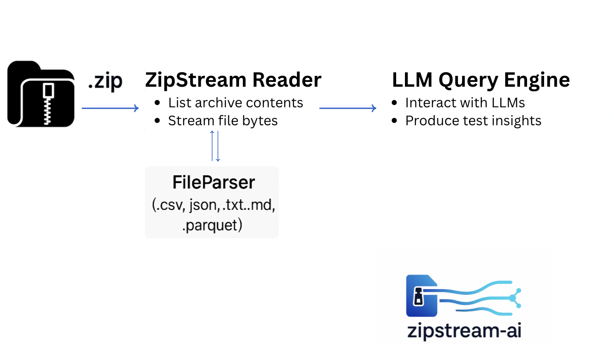

# Summary

Compressed datasets provided as `.zip` or `.tar.gz` archives are becoming increasingly popular in exploratory data analysis workflows, mainly across the domains of academic research which involves large and complex datasets. These archives usually contain structured files, such as CSV, JSON, or TXT, but these data files also need pre-processing, which usually involves the user following procedures like file extraction, inspection, and before the data could be actually used in the research package. Currently, without human conversion or summarization, these files cannot be directly processed by contemporary AI technologies that use Large Language Models (LLMs).

The **zipstream-ai** is LLM-integrated Python package that allows users to stream, parse, and query structured files inside compressed archives without extraction. This package is valuable for users who frequently work with large and complex datasets which are often wrapped in a zip format  and want to minimize latency in exploration or integrate them into AI pipelines.

zipstream-ai offers both a Python API and a command-line interface (CLI) for programmatic use. It auto-detects file formats, converts them into structured Python objects, and allows users to query the contents using natural language via Google's Gemini models.


## Statement of Need
Compressed Datasets are the norm when it comes to modern research. However, conventional Python libraries like tarfile and zipfile lack essential usability aspects and only offer low-level archive access. They don't enable high-level interfaces like natural language searches, interact with tools like pandas, or automatically identify file kinds. Before any valuable insight can be discovered, users must manually unpack archives, examine files, and create boilerplate parsing templates. Such overhead work can limit the adoption of LLM-based technology in real-world processes.

In LLM-powered systems, where agents are supposed to interact with data seamlessly, these constraints are troublesome. A large percentage of real-world datasets are still inaccessible to LLM workflows in the absence of a smooth method for retrieving structured material from archives.

`zipstream-ai` addresses this gap by allowing users to directly stream and parse common file from within compressed archives and immediately interact with them using large language models. This enables AI-native exploration of zipped datasets without manual overhead.

The package supports both programmatic and CLI workflows. It’s ideal for users who want to:

- interact with structured data inside compressed files without manual extraction,
- explore ZIP archives directly within Jupyter like environments,
- integrate compressed datasets into Retrieval-Augmented Generation (RAG) pipelines,
- perform natural language querying of archived data using LLMs.

## Methodology

The architecture of `zipstream-ai` is built around three primary Python modules. `ZipStreamReader` allows users to directly stream and list contents from compressed `.zip` and `.tar.gz` archives without requiring extraction. This minimizes disk usage and accelerates the workflow, particularly for large datasets. 

Secondly, `FileParser` automatically detects file formats such as `.csv`, `.json`, `.txt`, and `.md`, and parses them into structured Python-native objects, usually using `pandas`. It also detects common delimiters like commas, semicolons, or tabs, for flexible parsing.

The third component, `ask()`, enables natural language interaction with the parsed data by leveraging OpenAI’s GPT models. This function constructs prompts from representative data and queries the LLM to generate insights or perform analytical reasoning.

To support diverse usage, the package includes `.env` file support for secure API key management via `python-dotenv`, and a command-line interface (CLI) built with `typer` that supports interactive browsing and querying. The architecture is streaming-safe and is designed to plug into both Jupyter-based workflows and backend pipelines. Planned extensions include support for OCR and integration with open-source LLMs for offline use.

{ width=80% }

# Related Work

While Python provides built-in modules like zipfile and tarfile for archive access, they operate at a low level and do not integrate with data parsing or natural language interfaces. Libraries in pandas support reading from compressed paths like .zip archives [@smith2021rawarray] but only if the internal file name is known. They also do not support archive exploration or file listing. Other tools, such as Hugging Face Datasets [@sant2025multimodalhugs], allow loading datasets from compressed formats but require predefined dataset configurations.
Recent research has explored leveraging large language models (LLMs) for structured data interaction, including natural language interfaces for visualization generation, analytical reasoning, and API-driven code synthesis [@narechania2020nl4dv; @li2024llm; @pochinkov2024extracting]. These approaches typically assume that data has already been extracted, cleaned, and loaded into tabular formats, leaving the upstream challenges of accessing and parsing compressed datasets unaddressed. Other systems have investigated LLM-assisted data preparation and retrieval-augmented generation (RAG) pipelines [@lewis2020retrieval], but they similarly rely on preprocessed inputs.
zipstream-ai is the first open-source tool that combines archive streaming, format detection, data parsing, and LLM-based natural language querying into a single lightweight interface usable via both Python and CLI.

# Implementation

The package is implemented in Python 3.8+ and relies on several widely adopted libraries like `pandas` for data manipulation, `openai` for LLM access, `typer` for building the command-line interface, and `python-dotenv` for managing environment variables securely. The LLM integration is handled via Google Gemini with extensive testing across both Gemini's 2.0 and 3.0 models to ensure compatibility.

The CLI is built using `typer`, allowing for clean argument parsing and quick extensibility. For development and testing, `pytest` is used, and the package supports editable installation to facilitate rapid iteration. The entire project is open-source under the MIT license, available on GitHub, and published on PyPI for ease of installation.

```python
from zipstream_ai import ZipStreamReader, FileParser
from zipstream_ai.llm_query_engine import ask

reader = ZipStreamReader("datasets/sample_data.zip")

# Listing files inside the archive
files = reader.list_files()
print(files)

# Parse a CSV file directly from the archive
parser = FileParser(reader)
df = parser.load("sales_data.csv")

# Query the data via an LLM
response = ask(df, "Which product category has the highest total sales?")
print(response)
```

## Acknowledgements

This project was developed by Pranav Motarwar, Rudra Patil and Ashutosh Lembhe as part of their applied machine learning research work. The tool reflects an independent effort to streamline LLM-based interaction with compressed datasets.

# References

